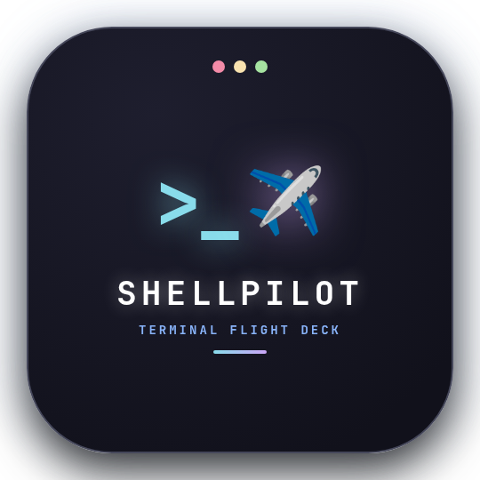
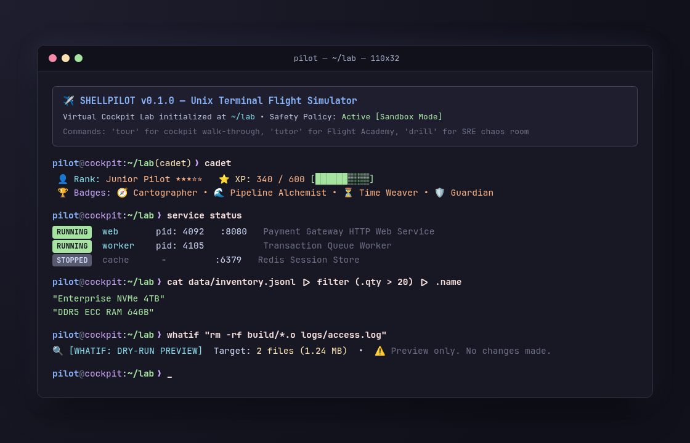
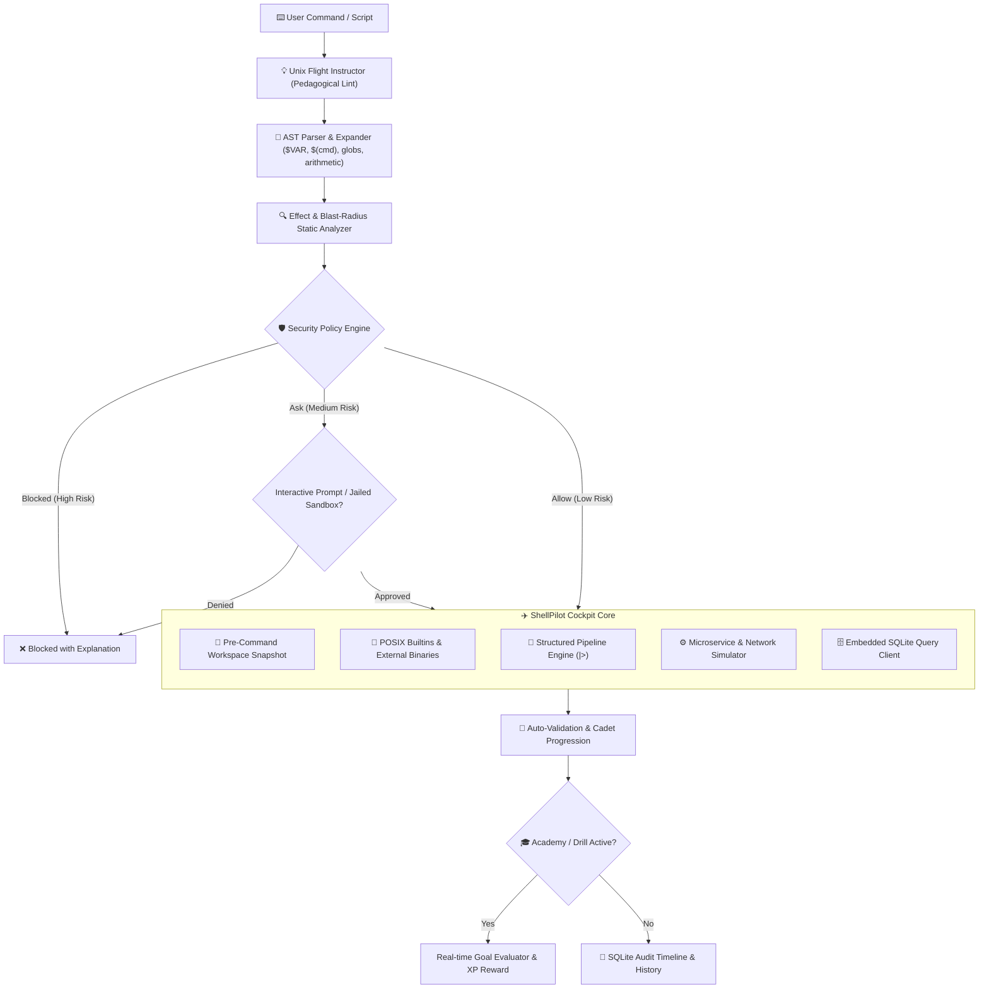
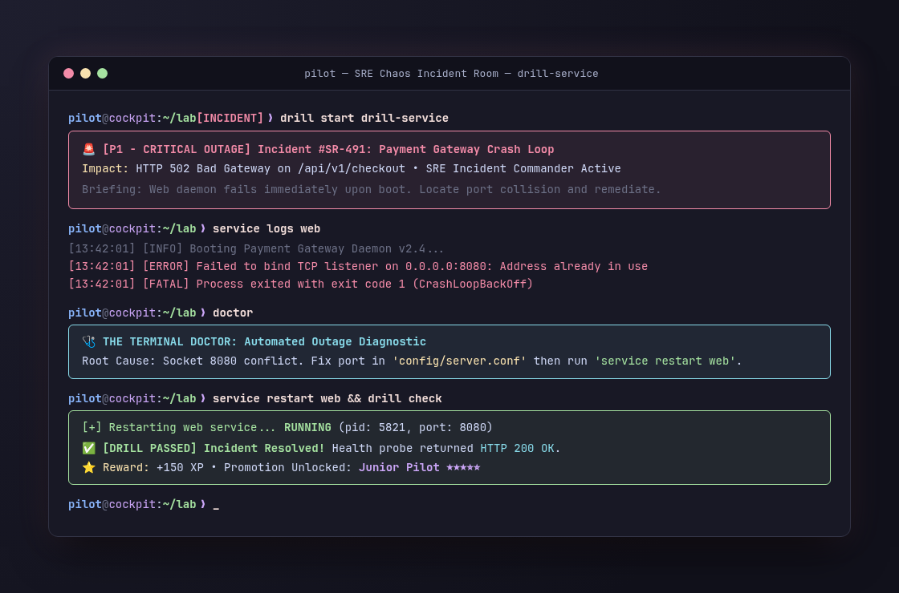

<p align="center">
  
</p>

# ShellPilot ✈️

<p align="center">
  <strong>The Flight Simulator for the Unix Command Line — Gamified Linux Training, SRE Chaos Drills & Interactive Cockpit</strong>
</p>

<p align="center">
  <a href="LICENSE"></a>
  
  
  
  
</p>

<p align="center">
  
</p>

---

`ShellPilot` is an interactive command-line flight simulator designed to train developers, sysadmins, and DevOps/SRE engineers in Unix systems, shell fluency, microservice operations, and emergency incident response without fear of breaking real servers.

Combining an authentic POSIX shell execution engine with an isolated virtual server laboratory (`~/lab`), instant time-travel rollback (`undo`), pedagogical flight instructor linting, a living microservice fleet, an embedded relational SQLite database, and structured object pipelines (`|>`), ShellPilot bridges the gap between basic shell tutorials and high-stakes production operations.

> [!NOTE]
> **Educational Flight Simulator:** ShellPilot is built as a learning cockpit, training lab, and pedagogical tool. While its POSIX language parser and execution engine handle real Linux commands, its security policies and sandboxes are educational aids rather than hypervisor-level security isolation.

---

## 📑 Table of Contents

- [Architecture](#-architecture)
- [✨ Key Features](#-key-features)
- [🚀 Quick Start](#-quick-start)
  - [Requirements](#requirements)
  - [Building from Source](#building-from-source)
  - [Launch Modes](#launch-modes)
- [🧭 The Virtual Cockpit Lab (`~/lab`)](#-the-virtual-cockpit-lab-lab)
- [🎓 Interactive Flight Academy (`tutor`)](#-interactive-flight-academy-tutor)
- [🚨 Emergency Chaos Room (`drill`)](#-emergency-chaos-room-drill)
- [⚙️ Living Microservice Fleet & Network Sim](#️-living-microservice-fleet--network-sim)
- [🗄️ Embedded SQLite Database Engine (`db`)](#️-embedded-sqlite-database-engine-db)
- [🧭 The Guidance Pack (`tree`, `cheat`, `doctor`)](#-the-guidance-pack-tree-cheat-doctor)
- [🎖️ Cadet Career & Achievement Badges (`cadet`)](#️-cadet-career--achievement-badges-cadet)
- [⏳ Time-Travel & Safe Experimentation (`whatif`, `undo`)](#-time-travel--safe-experimentation-whatif-undo)
- [🔮 Structured Stream Pipelines (`|>`)](#-structured-stream-pipelines-)
- [💡 Unix Flight Instructor Lints](#-unix-flight-instructor-lints)
- [🛡️ Command Awareness & Security Policy](#️-command-awareness--security-policy)
- [📋 Builtin Command Reference](#-builtin-command-reference)
- [🛠️ Development & Testing](#️-development--testing)
- [📄 License](#-license)

---

## 🏛 Architecture



---

## ✨ Key Features

- 🎓 **Interactive 7-Track Flight Academy (`tutor`)** — 26 progressive hands-on challenges with live auto-validation, step-by-step hints, and reference solutions.
- 🚨 **Emergency Outage Chaos Drills (`drill`)** — 7 simulated P1/P2 production incidents (crash loops, expired SSL certs, runaway disks, DoS floods) with real-time verification.
- ⏳ **Time-Travel & Rollback Engine (`undo`)** — Automated file snapshots, unified color diffs (`undo diff`), and zero-loss instant rollbacks when commands go wrong.
- 🔍 **Dry-Run Blast-Radius Previews (`whatif`)** — Simulates destructive commands (`rm -rf`, bulk overwrites), displaying target file counts and disk footprint before making changes.
- ⚙️ **Living Microservice Fleet Manager (`service`)** — Control background service lifecycles (`start`, `stop`, `restart`, `status`, `logs`) in a simulated staging cluster.
- 🌐 **Integrated Network Diagnostics (`curl`, `ping`, `netstat`)** — Query mock HTTP JSON APIs, test socket listeners, and simulate ICMP round-trip latency.
- 🗄️ **Embedded SQLite Database Engine (`db`)** — Query live relational tables (`customers`, `orders`, `system_metrics`) with schema inspection and ASCII table formatting.
- 🧭 **The Guidance Pack (`tree`, `cheat`, `doctor`)** — Visual directory hierarchy tree, instant offline Unix syntax recipes for 15+ tools, and an intelligent terminal doctor diagnosing failed commands.
- 🎖️ **Cadet Career Progression (`cadet` / `profile`)** — Earn XP, rank promotions from Recruit to Fleet Admiral, and unlock 11 operational achievement badges.
- 🔮 **Structured Stream Operator (`|>`)** — Go beyond raw byte streams with native JSON/YAML/TOML object filtering, projections (`.field`), slicing (`take`/`skip`), and format transmutations.
- 💡 **Unix Flight Instructor Lints** — Real-time pedagogical warnings against shell anti-patterns (UUOC `cat|grep`, unquoted variables, insecure `chmod 777`, `kill -9`).
- 🐚 **Authentic POSIX Language** — Full shell scripting support: functions, loops (`for`, `while`), conditionals (`if`/`then`/`else`), arithmetic `$((...))`, command substitutions `$(...)`, pipes `|`, redirections (`>`, `>>`, `2>`, `&>`), and job control (`&`, `jobs`, `fg`, `bg`).

---

## 🚀 Quick Start

### Requirements

- Linux operating system (x86_64 or ARM64)
- Rust 1.85+ toolchain with Cargo

### Building from Source

```bash
git clone https://github.com/Kosss01/shellpilot.git
cd shellpilot

# Build optimized release binaries
cargo build --release
```

ShellPilot generates dual binaries for convenience:
- `./target/release/shellpilot` — Full binary
- `./target/release/pilot` — Short binary alias

### Launch Modes

```bash
# 1. Start interactive Flight Simulator (defaults to Academy & Virtual Lab)
./target/release/shellpilot

# 2. Or use the short alias:
./target/release/pilot

# 3. Start directly in the interactive Flight Academy:
./target/release/shellpilot --tutor

# 4. Start in an isolated virtual server sandbox with time-travel undo:
./target/release/shellpilot --sandbox

# 5. Start a standard clean interactive shell without the academy banner:
./target/release/shellpilot --plain

# 6. Execute one-line commands non-interactively:
./target/release/shellpilot -c "service status; db 'SELECT * FROM customers'"
```

---

## 🧭 The Virtual Cockpit Lab (`~/lab`)

Whenever ShellPilot starts in interactive mode or with `--sandbox`, it creates a safe, isolated virtual staging server rooted in `~/lab`. Any modifications, file deletions, or service mutations are contained in this sandbox and will never touch your host machine.

### Pre-loaded Lab Layout

```text
~/lab
├── app/
│   ├── app.py                # Python web service implementation
│   ├── config.json           # Microservice configuration & database settings
│   └── templates/index.html  # HTML frontend templates
├── config/
│   ├── database.yaml         # Backend database credentials & pools
│   ├── server.conf           # Web server ports, timeouts, and SSL configuration
│   └── settings.env          # Environment variable definitions
├── data/
│   ├── customers.csv         # Raw customer records for stream manipulation
│   ├── inventory.jsonl       # Hardware inventory in JSON Lines format
│   └── production.db         # Embedded relational SQLite database
├── logs/
│   ├── access.log            # Production HTTP access log with traffic streams
│   ├── auth.log              # Authentication failure events
│   └── error.log             # Application error traces
└── scripts/
    ├── backup.sh             # Automated archiving routine
    ├── deploy.sh             # Production deployment script
    └── healthcheck.sh        # System probe and status verifier
```

---

## 🎓 Interactive Flight Academy (`tutor`)

The Flight Academy provides a structured 7-track curriculum with 26 hands-on lessons. ShellPilot evaluates your terminal state in real time and automatically marks lessons as completed.

```bash
tutor list                 # View curriculum tracks and completion progress
tutor start <lesson_id>    # Begin a lesson (e.g. 'tutor start nav_01')
tutor check                # Validate if the mission objective has been satisfied
tutor hint                 # Request progressive pedagogical hints
tutor solution             # Reveal reference command and explanation
tutor reset                # Re-stage initial challenge environment
tutor next                 # Advance to the next lesson in the track
```

### Curriculum Tracks

| Track | Track Title | Lessons | Key Skills & Objectives |
| :--- | :--- | :---: | :--- |
| **1. Cadet** | Filesystem & Navigation | 4 | Absolute vs relative paths, nested directory surgery (`mkdir -p`), archiving (`cp`, `mv`), cache purging (`rm *`). |
| **2. Plumber** | Streams & Redirection | 4 | Standard output (`>`), stream appending (`>>`), stderr isolation (`2>`), pipeline chaining (`\|`), stream slicing (`cut`, `sort`). |
| **3. Guardian** | Permissions & Security | 3 | Executable bits (`chmod +x`), private key lockdown (`chmod 600`), read-only configuration hardening (`chmod 444`). |
| **4. Detective** | Searching & Text Processing | 3 | Case-insensitive searching (`grep -i`), directory pattern traversal (`find`), delimited data extraction (`cut -d, -f`). |
| **5. Incident Responder** | Troubleshooting Scenarios | 4 | Runaway disk crash dump cleanup, configuration recovery, stale daemon lockfile removal, broken shebang repairs. |
| **6. SRE** | Services & Resilience | 4 | Daemon lifecycle control (`service`), dry-run blast radius analysis (`whatif`), contextual diagnosis (`doctor`), API inspection (`curl`). |
| **7. Data Alchemist** | Structured `\|>` Pipelines | 4 | Direct field extraction (`.field`), numeric/string filtering (`filter`), stream truncation (`take`), JSON to YAML transmutation. |

---

## 🚨 Emergency Chaos Room (`drill`)

<p align="center">
  
</p>

Put your production troubleshooting skills to the test under realistic incident conditions:

```bash
drill list                 # List all 7 emergency incident drills
drill start <drill_id>     # Trigger an outage scenario (e.g. 'drill start drill-web')
drill hint                 # Receive incident commander guidance
drill check                # Verify if production is healthy and the alert is resolved
drill abandon              # Safely rollback to clean state
```

### Incident Scenarios

| Drill ID | Priority | Incident Name | Scenario Briefing |
| :--- | :---: | :--- | :--- |
| `drill-disk` | `P1 - CRITICAL` | **Runaway Crash Dump Quota** | Disk quota is 100% full due to a rogue crash dump in `logs/`. Locate and delete the core dump without destroying live access logs. |
| `drill-service` | `P1 - CRITICAL` | **Payment API Crash Loop** | The payment web service crashes on boot. Inspect `service logs web`, fix the port conflict in `config/server.conf`, and restart. |
| `drill-lock` | `P2 - HIGH` | **Deadlocked Worker Lockfile** | The background queue worker fails to boot because a crashed run left a stale PID lockfile at `services/worker.lock`. Clean it and reboot. |
| `drill-perm` | `P1 - CRITICAL` | **Security Breach: Key Permissions** | Automated audit detects SSH deploy key `keys/deploy_key.pem` is world-writable (mode 777). Restrict to owner-only mode 600. |
| `drill-cert` | `P1 - CRITICAL` | **Expired SSL Certificate Emergency** | Payment gateway throws SSL handshake failures. Swap expired `config/ssl/cert.pem` with renewed cert staged in `keys/new_cert.pem`. |
| `drill-dos` | `P1 - CRITICAL` | **Denial-of-Service Flood Defense** | High-volume HTTP flood detected. Analyze `logs/access.log` to isolate the attacker IP and append it to `config/blocklist.conf`. |
| `drill-db` | `P2 - HIGH` | **Database Host Desynchronization** | Microservice in `app/config.json` fails to reach DB because host is set to a dead endpoint. Update to `127.0.0.1` and verify. |

---

## ⚙️ Living Microservice Fleet & Network Sim

ShellPilot includes a built-in process and network simulation layer:

```bash
# Check service states
service status

# Start and monitor the web microservice
service start web
service logs web

# Probe HTTP endpoints directly from the shell
curl http://localhost:8080/health

# Inspect active listening sockets and ports
netstat

# Test ICMP network latency
ping localhost
```

---

## 🗄️ Embedded SQLite Database Engine (`db`)

Inspect and query relational data without installing external database clients:

```bash
# Display available tables and row counts
db

# Inspect schema definitions
db schema

# Run SQL queries with ASCII tabular formatting
db "SELECT id, name, email, plan FROM customers WHERE plan = 'enterprise'"
```

```text
┌──────┬─────────────┬─────────────────┬────────────┐
│ id   │ name        │ email           │ plan       │
├──────┼─────────────┼─────────────────┼────────────┤
│ 1001 │ Alice Chen  │ alice@acme.corp │ enterprise │
│ 1004 │ Dana Scully │ dana@fbi.gov    │ enterprise │
└──────┴─────────────┴─────────────────┴────────────┘
(2 rows returned)
```

---

## 🧭 The Guidance Pack (`tree`, `cheat`, `doctor`)

### 1. Visual Directory Tree (`tree`)
Renders an instant, color-coded ASCII directory hierarchy:
```bash
tree               # Render directory tree down to 4 levels deep
tree -d            # Display directories only
tree -L 2          # Limit rendering to depth of 2
```

### 2. Instant Offline Cheatsheets (`cheat`)
Fast, syntax-highlighted recipe cards with key flags and real-world examples:
```bash
cheat              # List all 15 supported tool cards
cheat grep         # Display grep flags & practical recipes
cheat find         # Display find search patterns
cheat chmod        # Display permission modes and octal masks
cheat service      # Display mock service management syntax
```

### 3. The Terminal Doctor (`doctor`)
Intelligently analyzes the last failed command, error code, and filesystem context to explain the root cause and suggest the exact fix:
- Detects nested directory creation without `-p` (`mkdir a/b/c` → suggests `mkdir -p a/b/c`)
- Detects directory removal without `-r` (`rm mydir` → suggests `rm -r mydir`)
- Detects missing `./` on script execution (`deploy.sh` → suggests `./deploy.sh` or `./scripts/deploy.sh`)
- Detects typos in filenames using Levenshtein distance matching
- Detects permission denied failures and recommends `chmod +x`

---

## 🎖️ Cadet Career & Achievement Badges (`cadet`)

ShellPilot gamifies your Linux learning curve by awarding XP for every command, lesson completed, drill solved, and rollback performed.

```bash
cadet              # View your rank, XP progression, and badges
profile            # Alias for 'cadet'
```

### Rank Hierarchy

1. **Recruit** (0 XP)
2. **Flight Cadet** (100 XP)
3. **Junior Pilot** (300 XP)
4. **Senior Aviator** (600 XP)
5. **Flight Commander** (1000 XP)
6. **Fleet Admiral** (1500+ XP)

### Unlockable Achievement Badges

| Badge | Title | Requirement |
| :---: | :--- | :--- |
| 🧭 | **Cartographer** | Complete all Filesystem & Navigation challenges |
| 🌊 | **Pipeline Alchemist** | Master pipes, redirections, and stream filters |
| 🛡️ | **Guardian of Permissions** | Harden scripts, keys, and confidential files |
| 🕵️ | **Master Detective** | Solve all search, inspection, and grep challenges |
| 🚒 | **First Responder** | Resolve all emergency server incident challenges |
| ⏳ | **Time Weaver** | Successfully utilize both dry-run `whatif` and time-travel `undo` |
| 🚨 | **Drill Specialist** | Successfully resolve emergency chaos drills |
| 🛡️ | **SRE Commander** | Master microservices, diagnostics, and recovery |
| 🔮 | **Data Alchemist** | Master structured data pipelines and transmutations |
| 🗄️ | **Database Sorcerer** | Query and manage the embedded SQL database |
| 🌐 | **Netrunner** | Test network sockets and latency with `ping` and `netstat` |

---

## ⏳ Time-Travel & Safe Experimentation (`whatif`, `undo`)

### Dry-Run Blast Radius Preview (`whatif`)
Simulates destructive commands before running them, calculating exactly how many files will be deleted or overwritten and their disk space impact:

```bash
whatif "rm -rf build/*.o logs/*.log"
```

```text
🔍 [WHATIF: DRY-RUN PREVIEW]
Command: rm -rf build/*.o logs/*.log

Actions:
  ❌ Delete: build/main.o (42 KB)
  ❌ Delete: logs/access.log (1.2 MB)

Summary:
  • 2 file(s) target of deletion
  • Estimated space to be freed: 1.24 MB
⚠️  [Dry-run preview only. No actual changes were made to disk.]
```

### Visual Diff & Instant Rollback (`undo`)
ShellPilot automatically snapshots your workspace before modifying commands:

```bash
# Accidental destructive command:
rm -rf config/server.conf

# Inspect what changed:
undo diff

# Roll back workspace instantly to pre-command state:
undo
```

---

## 🔮 Structured Stream Pipelines (`|>`)

Unix pipes (`|`) pass raw bytes. ShellPilot introduces the structured pipeline operator (`|>`), allowing you to treat JSON, YAML, TOML, and CSV records as typed objects:

```bash
# Project specific object keys
cat data/inventory.jsonl |> .name

# Filter stream by numeric or string predicates
cat data/inventory.jsonl |> filter .qty > 20 |> .name

# Slicing and pagination
cat data/inventory.jsonl |> take 2

# Count structured records
cat data/inventory.jsonl |> count

# Transmute formats on the fly
cat app/config.json |> yaml
cat app/config.json |> toml
cat data/inventory.jsonl |> table
```

---

## 💡 Unix Flight Instructor Lints

In interactive mode, ShellPilot acts as a watchful co-pilot, intercepting anti-patterns before execution and displaying actionable advice:

| Anti-Pattern | Severity | Co-Pilot Recommendation |
| :--- | :---: | :--- |
| `cat file \| grep pattern` | 💡 Advice | **UUOC (Useless Use of Cat):** Run `grep pattern file` directly to save an unnecessary process and pipe. |
| `cat file \| wc -l` | 💡 Advice | Run `wc -l < file` or `wc -l file` to avoid spawning `cat`. |
| `chmod 777 file` | 🛡️ Security | World-writable files create security risks. Use `chmod 755` for executables or `chmod 644` for files. |
| `kill -9 <pid>` | ⚠️ Warning | SIGKILL leaves sockets open and corrupts lockfiles. Send `kill <pid>` (SIGTERM) first to allow graceful cleanup. |
| `mkdir a/b/c` | 💡 Advice | Creating nested directories requires `mkdir -p a/b/c` if parent directories do not exist yet. |

---

## 🛡️ Command Awareness & Security Policy

### Command Breakdown (`explain`)
Inspect any command before executing to understand flags, resolved path, and risk level:

```bash
explain "rm -rf /tmp/test"
```

```text
Command Breakdown:
  • Command: rm -rf /tmp/test
    - Type: External Executable (/usr/bin/rm)
    - Purpose: Remove files or directories.
    - Flags:
      • -r: Recursive deletion
      • -f: Force deletion without prompting
Effects Identified:
  • FilesystemDelete: Deletes files or directories at '/tmp/test'
  • ProcessCreation: Spawns an isolated child process
Security Policy:
  • Decision: ASK (requires interactive confirmation)
  • Risk Level: Medium
```

### Audit Timeline (`timeline`)
ShellPilot records every executed command, execution duration, process IDs, and exit status in a persistent SQLite timeline:

```bash
timeline             # Display recent command execution history and metrics
timeline 10          # Show last 10 commands with timestamps and exit codes
```

---

## 📋 Builtin Command Reference

| Command | Category | Description |
| :--- | :--- | :--- |
| `tour` / `explore` | Cockpit | Launch guided walkthrough of flight simulator features. |
| `tutor` | Academy | Interactive 7-track Linux and shell training academy (`list`, `start`, `check`, `hint`, `solution`, `next`). |
| `drill` | SRE Chaos | Production outage incident drills (`list`, `start`, `check`, `hint`, `abandon`). |
| `cadet` / `profile` | Progression | View cadet rank, XP breakdown, stats, and unlockable achievement badges. |
| `whatif <cmd>` | Safety | Dry-run preview of command effects, file deletions, and blast radius. |
| `snapshot <name>` | Safety | Save a named restore checkpoint of the current workspace. |
| `undo` | Safety | Roll back workspace to the previous command checkpoint. |
| `undo diff` | Safety | View unified color diff of changes made since last checkpoint. |
| `service` | Operations | Manage background daemons (`status`, `start`, `stop`, `restart`, `logs`). |
| `curl <url>` | Operations | Query HTTP endpoints against mock services. |
| `netstat` | Operations | Inspect active listening network sockets and ports. |
| `ping <host>` | Operations | Measure ICMP latency and packet round-trip times. |
| `db` | Database | Integrated SQLite query client and schema browser. |
| `tree [dir]` | Guidance | Render visual ASCII directory hierarchy (`-d`, `-L <depth>`). |
| `cheat [tool]` | Guidance | Display instant offline Unix cheatsheet recipes. |
| `doctor` | Guidance | Post-mortem diagnostic engine analyzing failed commands and offering fixes. |
| `explain <cmd>` | Analysis | AST breakdown of flags, blast radius, and security policy. |
| `policy` | Security | Inspect current safety policy rules and risk thresholds. |
| `timeline` | Audit | Display persistent execution timeline with timestamps and exit codes. |
| `abbr` | Convenience | Manage command abbreviations expanded upon spacebar. |
| `alias` / `unalias` | Builtin | Create and remove command aliases. |
| `cd` / `pwd` | Builtin | Change and print current working directory. |
| `export` / `unset` | Builtin | Manage environment variables. |
| `jobs` / `fg` / `bg` / `kill` | Builtin | Background process inspection and job control. |

---

## 🛠️ Development & Testing

Run the full multi-threaded test suite:

```bash
cargo test
```

Run tests with verbose output:

```bash
cargo test -- --nocapture
```

Check formatting and linting:

```bash
cargo check
cargo clippy
```

---

## 📄 License

ShellPilot is released under the [MIT License](LICENSE).
Copyright (c) 2026 Kosss01.
